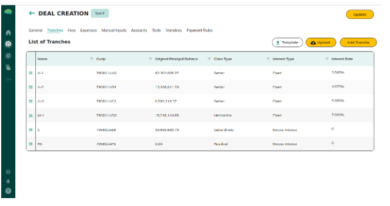

# Investor Commitment Phase

The Commit phase is the first stage of investor participation in a securitization deal. Investors indicate how much they want to invest in each tranche — without transferring funds yet. The deal must be **Open** (published to investors by the Issuer) before this phase can begin.

---

## Workflow Overview

```
Issuer publishes deal to investors → deal goes Open
    ↓
Underwriter opens Commit phase
    ↓
Investors view deal and available tranches
    ↓
Investor selects tranche → enters commit amount → submits
    ↓
Available Commitments on the tranche decreases
    ↓
Underwriter reviews total commitments
    ↓
Underwriter switches deal to Invest phase (selects payment mode)
```

---

## What Investors See

When an investor opens an Open deal in Commit phase, they see a **Tranche List** showing:

| Column | Description |
|--------|-------------|
| **Tranche Name** | Name of the tranche class |
| **Class Type** | Tranche classification (Senior, Mezzanine, etc.) |
| **Principal Balance** | Total capacity of this tranche |
| **Committed Amount** | Total already committed by all investors |
| **Available Commitments** | Principal Balance − Total Committed (how much remains open) |
| **Invested Amount** | Total already invested (0 during Commit phase) |
| **# Investors** | Number of investors who have committed to this tranche |


*Tranche list — shows available commitments, committed amounts, and investor count per tranche*

---

## How to Commit

1. Navigate to **Securitization** → click the deal
2. Click **Commit** on the tranche you want to invest in
3. Enter the **Commit Amount** in the modal
4. Click **Submit**

Your commitment is recorded. You can view your commitment amount in your investor dashboard.

---

## Validation Rules

- **Commit amount cannot exceed Available Commitments** — if a tranche has $500,000 available and you try to commit $600,000, the submission is blocked
- **One commitment per investor per tranche** — each investor can only have one commitment record per tranche; to change an amount, contact the Underwriter
- **Tranche must be Approved** — commitments are only accepted on tranches with Approved status
- **Deal must be in Commit phase** — committing is blocked if the deal is in Invest phase, Awaiting Approval, or Closed
- **Commit amount must be greater than zero**

> **Note:** A commitment is a declaration of intent — no funds transfer during the Commit phase. Funds only move when the deal switches to the Invest phase.

---

## Available Commitments Calculation

```
Available Commitments = Principal Balance − Total Committed
```

- **Principal Balance** is set when the Underwriter creates the tranche
- **Total Committed** is the sum of all investor commitments on that tranche
- Available Commitments decreases in real time as investors commit
- When Available Commitments reaches zero, no further commitments are accepted for that tranche

---

## When Commit Phase Ends

The Underwriter switches the deal to **Invest phase** when:
- Enough investor commitments have been received, or
- The commitment window has closed per deal terms

Once the deal moves to Invest phase, new commitments cannot be submitted. Existing committed investors proceed to transfer funds.

→ See [Investment & Settlement](92_Investment_and_Settlement.md) for what investors do in the Invest phase.

---

## Related Articles

→ See [Deal Lifecycle & Statuses](89_Securitization_Deal_Lifecycle_and_Statuses.md) for the full lifecycle and phase definitions.  
→ See [Securitization Roles & Permissions](95_Securitization_Statuses_and_Roles.md) for which roles can commit.
