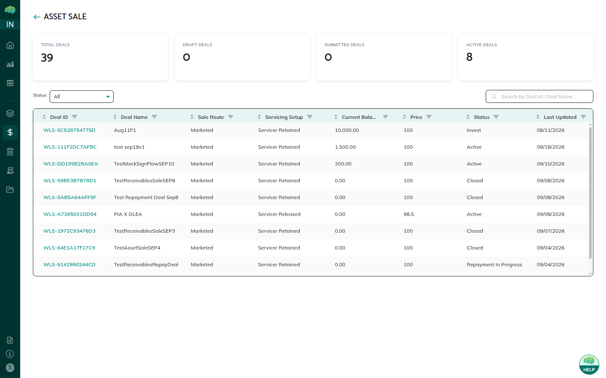

# Investment & Settlement

The Invest phase is when investors transfer actual funds and confirm their investment. A single **Invest** button covers all tranches the investor committed to — there is no need to invest tranche by tranche.

---

## Switching to Invest Phase

**Who:** Underwriter  
**When:** After collecting sufficient investor commitments

1. Navigate to the deal details page
2. Click **Switch to Invest Phase**
3. Select the **Payment Mode**:
   - **Offchain** — investors transfer via bank wire; Paying Agent approves the payment
   - **Onchain** — investors transfer USDC via MetaMask; settlement is automatic on-chain
4. Confirm the switch

> ⚠️ The payment mode cannot be changed after switching to Invest phase. All investors in the deal use the same payment method.

---

## Investor Actions — Single Invest Button

When the deal is in Invest phase, the investor sees an **Invest** button that applies to all their committed tranches simultaneously:

1. Navigate to **Securitization** → click the deal
2. Click **Invest** (one button for all committed tranches)
3. Complete the payment step based on payment mode (see below)
4. Investment is recorded for each committed tranche

There is no per-tranche invest action — one click covers the investor's full commitment across the deal.

---

## Offchain Payment Flow (Bank Wire)

1. Investor clicks **Invest**
2. Investor makes a bank wire transfer for the total committed amount (outside of Intain Markets)
3. The pending transaction appears in the **Paying Agent's dashboard**
4. Paying Agent reviews the wire details → clicks **Approve**
5. After Paying Agent approval, the investment is marked complete and FTs are delivered

> The Paying Agent must approve each investor's offchain payment before FTs are released. FTs are not delivered automatically for offchain deals.

---

## Onchain Payment Flow (USDC via MetaMask)

1. Investor clicks **Invest**
2. MetaMask wallet connects when prompted
3. Investor reviews the USDC amount (equal to total committed amount)
4. Investor confirms the USDC transaction in MetaMask
5. The on-chain transaction is verified
6. USDC and FT transfer both happen **automatically** — no Paying Agent approval required

*Investor view of a securitization deal in Invest phase*

---

## Settlement Record

A settlement record is created when the investor clicks **Invest**. It tracks:

- The deal and tranches invested in
- Total amount invested
- Payment mode used
- Date of confirmation
- Status (Pending → Completed after Paying Agent approval for offchain, or after on-chain confirmation)

---

## Rules & Validations

- Investors can only invest up to their committed amount
- Investors who did not commit in the Commit phase cannot invest
- For offchain deals: Paying Agent approval is required before investment is marked complete
- For onchain deals: the MetaMask wallet must hold sufficient USDC balance
- The deal must be in Invest phase — investing is blocked in any other status

---

## After Investment: FT Delivery

- **Onchain:** FTs are transferred automatically with the USDC payment
- **Offchain:** After Paying Agent approves the payment, the Paying Agent delivers FTs separately (MFA required)

→ See [Token Approval & FT Delivery](93_Token_Approval_and_FT_Delivery.md) for the Issuer FT approval and Paying Agent delivery steps.

---

## Related Articles

→ See [Investor Commitment Phase](91_Investor_Commitment_Phase.md) for the prior Commit phase.  
→ See [Token Approval & FT Delivery](93_Token_Approval_and_FT_Delivery.md) for FT delivery after investment.  
→ See [Deal Lifecycle & Statuses](89_Securitization_Deal_Lifecycle_and_Statuses.md) for payment mode details.
