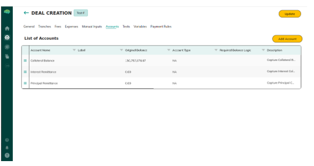

# Accounts & Transactions

The Paying Agent and Underwriter use deal accounts to track fund flows for a securitization deal. Each deal can have multiple accounts by type, and each account has a transaction ledger used for ESMA reporting and payment tracking.

---

## Account Management

**Who manages accounts:** Paying Agent and Underwriter  
**Where:** Deal details page → Accounts section

---

## Account Types

Each account is assigned one of four types, corresponding to its role in the deal cash flows:

| Account Type | Purpose |
|-------------|---------|
| **Closing** | Holds funds collected at deal closing |
| **Principal Remittance** | Tracks principal repayments flowing to investors |
| **Interest Remittance** | Tracks interest payments to investors |
| **Collateral Balance** | Holds the value of the collateral supporting the deal |

A deal can have multiple accounts of the same type if needed (e.g., separate Interest Remittance accounts per tranche).

---

## Account Fields

When creating or viewing an account, the following fields are recorded:

| Field | Description |
|-------|-------------|
| **Account Name** | Descriptive name for the account |
| **Account Type** | One of the four types above |
| **Bank Details** | Bank name, account number, routing number (stored encrypted) |
| **Beginning Balance** | Opening balance for the reporting period |
| **Period Month** | Month of the reporting period |
| **Period Year** | Year of the reporting period |


*Accounts list — showing account types, balances, and period details*

---

## Ending Balance Calculation

The Ending Balance of an account is calculated as:

```
Ending Balance = Beginning Balance + Sum of all Completed transactions on the account
```

- Only **Completed** transactions are included in the Ending Balance calculation
- **Pending** and **Failed** transactions are excluded
- The Ending Balance updates automatically as transactions are added and completed

---

## Transaction Ledger

Each account maintains a transaction ledger. Transactions are added by the **Paying Agent** to record individual payments in or out of the account.

### Transaction Fields

| Field | Description |
|-------|-------------|
| **Account** | Which account this transaction belongs to |
| **Payment Type** | Type of payment (e.g., Principal, Interest, Fee) |
| **Amount** | Dollar amount of the transaction |
| **Status** | Pending, Completed, or Failed |
| **Description** | Free-text notes about the transaction |
| **Payment Date** | Date the payment was made or expected |
| **Tranche** | Which tranche this transaction is associated with (optional) |

### Transaction Statuses

| Status | Meaning |
|--------|---------|
| **Pending** | Transaction recorded but not yet confirmed |
| **Completed** | Transaction has been confirmed and is included in Ending Balance |
| **Failed** | Transaction was attempted but did not complete |

---

## Why the Ledger Matters

The transaction ledger is the primary tool for:

- **Compliance reporting** — ESMA reporting uses ledger data to generate required disclosures
- **Investor transparency** — investors can see payment records for their tranche
- **Audit trail** — every payment is timestamped and associated with a specific tranche and account
- **Reconciliation** — the Paying Agent uses ledger data to reconcile bank statements with deal records

→ See [ESMA Reporting](62_ESMA_Reporting.md) for how ledger data is used in regulatory reports.

---

## Servicer Monthly Loan Tape Uploads

After the deal closes, the **Servicer** is responsible for keeping the loan data current. Each month:

1. Servicer navigates to the **Securitization** deal → **Imports** or **Asset Registry** section
2. Servicer uploads the monthly **loan tape** — an updated file containing current loan balances, payments received, and status for every loan in the pool
3. The platform ingests and validates the loan tape
4. Updated loan data becomes available for reporting

Monthly uploads keep the deal's loan data accurate and are required for investor reporting and ESMA compliance.

---

## Investor Monthly Reporting

Once the deal is active and monthly loan tapes are uploaded, investors can view:

- **Portfolio summary** — total invested, FT balance, current tranche performance
- **Monthly loan performance** — loan-level data for the pool underlying their tranches
- **Payment history** — principal and interest payments received per period
- **ESMA compliance reports** — for European regulatory requirements

Investors access reporting through the **Securitization** deal details → **Reports** section.

→ See [ESMA Reporting](62_ESMA_Reporting.md) for regulatory reporting details.

---

## Related Articles

→ See [Token Approval & FT Delivery](93_Token_Approval_and_FT_Delivery.md) for Paying Agent FT delivery responsibilities.  
→ See [Securitization Roles & Permissions](95_Securitization_Statuses_and_Roles.md) for which roles can manage accounts.  
→ See [ESMA Reporting](62_ESMA_Reporting.md) for regulatory reporting using account data.
